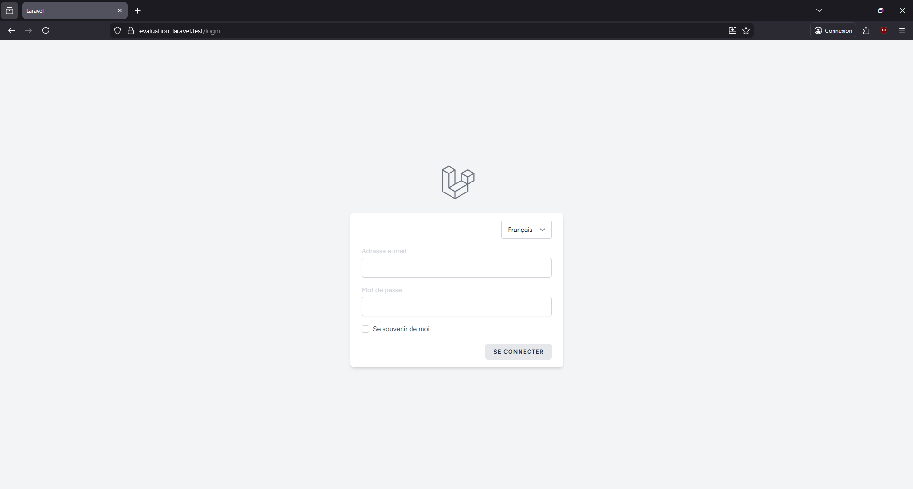
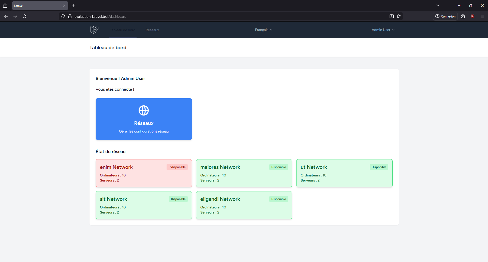
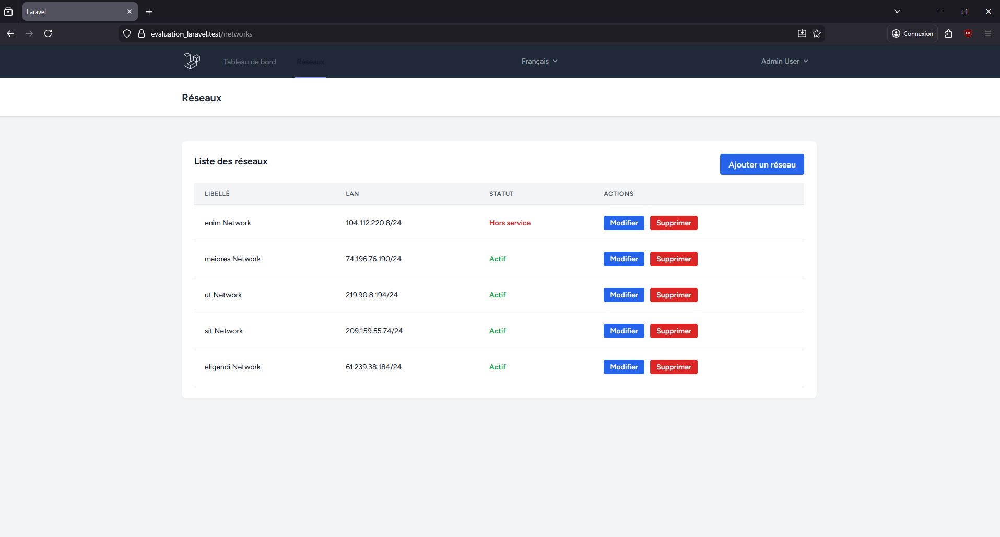
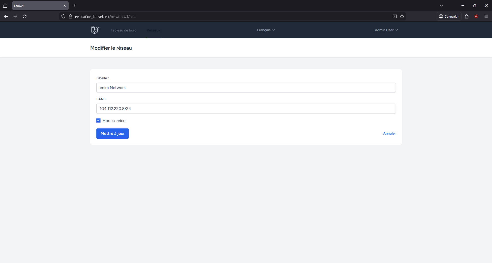
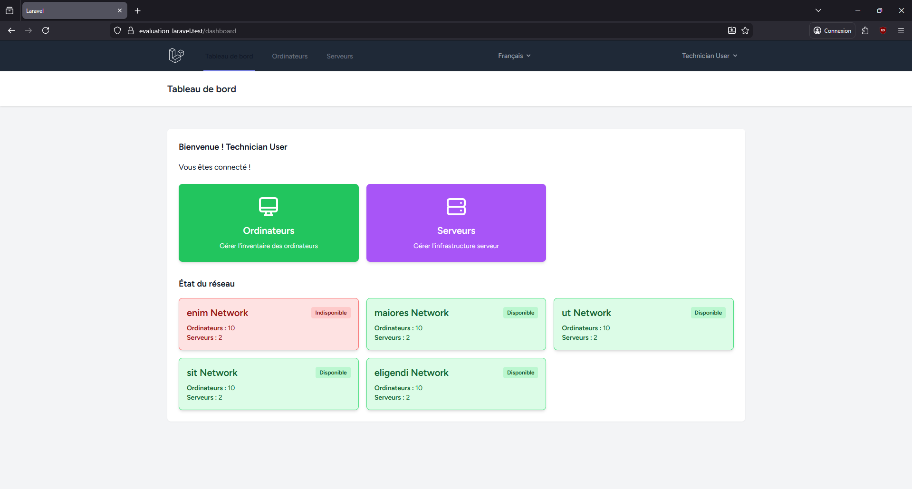
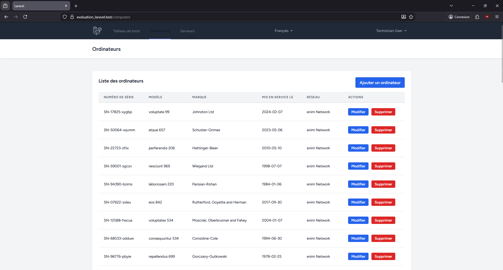
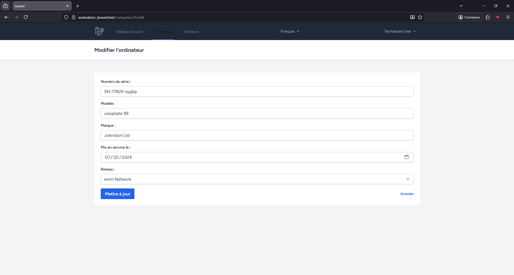
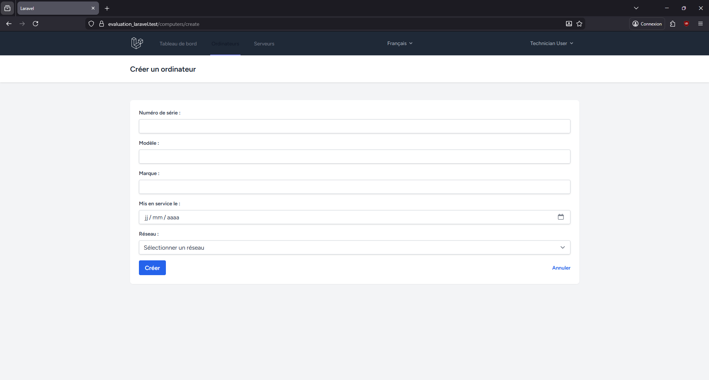
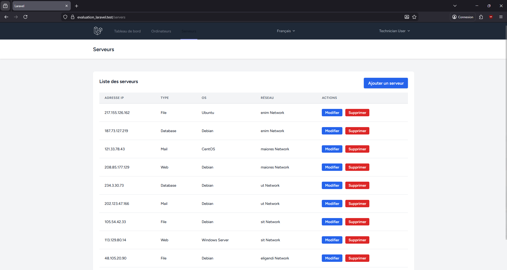
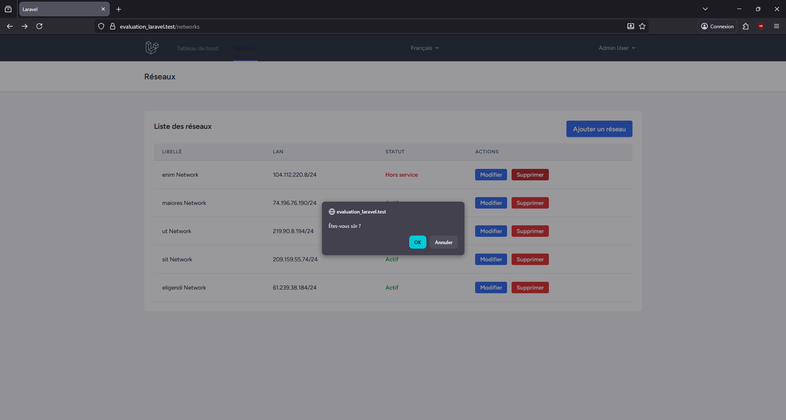

Ce projet est une application de gestion de parc informatique développée avec Laravel 11. Elle permet de gérer des réseaux, des ordinateurs et des serveurs avec un système de permissions basé sur des rôles.

    Technologies utilisées:
  - Laravel 12
  - Laravel Breeze
  - MySQL
  - TailwindCSS
  - Alpine.js
  - Vite
  - Silber/Bouncer (Gestion des rôles)
  - PHP 8.4

    Fonctionnalités

- Authentification : Système complet de connexion (Laravel Breeze).
- Gestion des Rôles et Permissions :
  - Admin :  gestion des réseaux.
  - Technicien : Gestion des ordinateurs et des serveurs.
- Gestion des Ressources :
  - Réseaux : Création, modification, suppression, statut (Hors service).
  - Ordinateurs : Suivi par numéro de série, modèle, marque, date de mise en service.
  - Serveurs : Suivi par IP, type, OS.
- Internationalisation : Interface disponible en Français et Anglais.

##  Prérequis

- PHP 8.2+
- Composer
- Node.js & NPM
- Base de données (MySQL)

  Installation

Ce projet est conçu pour être facilement déployé avec Laravel Herd.

1. Cloner le dépôt
   Clonez le projet dans votre dossier géré par Herd .
   git clone <votre-url-de-depot>

2. Installer les dépendances

   composer install
   npm install
   npm run build

3. Configurer l'environnement

   cp .env.example .env
   php artisan key:generate

   Configurez votre base de données dans le fichier `.env`.

4. Exécuter les migrations et les seeders
    php artisan migrate --seed
   Cette commande crée les tables et injecte les données de test.

5. Accéder à l'application
   Ouvrez votre navigateur sur :
   https://evaluation_laravel.test

  Utilisateurs par défaut

Le seeder crée deux utilisateurs pour tester les différents rôles :

 Administrateur | `admin@example.com` | `Not24get` | Gérer les réseaux 
 Technicien | `tech@example.com` | `Not24get` | Gérer les ordinateurs et serveurs 

page de connexion ;

Compte Admin :

page d'accueil pour admin 

page liste des réseaux 

page modifier un réseau 

page ajouter un réseau

Compte Technicien:

page d'accueil technicien 

page Ordinateur

page modification 

page ajout 

page serveur 

confirmation suppression 

